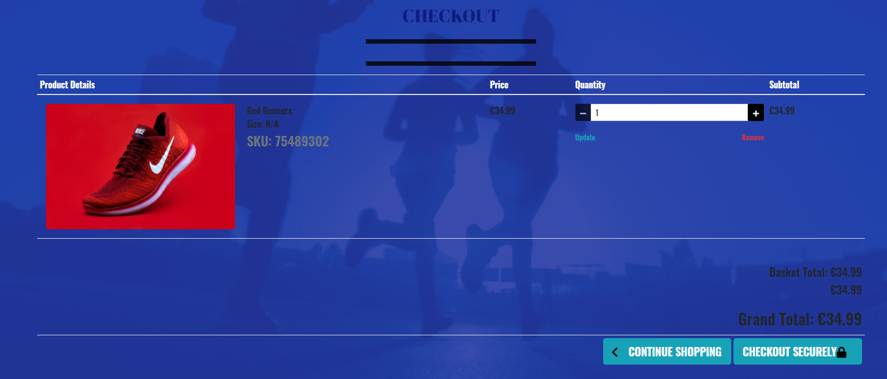

# Milestone Project 4 - Fit Time

### Click here for a link to the live project on Heroku
(Fit Time)[https://fit-time-ms4.herokuapp.com/]

An E-Commerce Data-Centric Development Project for Milestone 4.
  
The project is a web application based on the creation of a sports app.  It allows users to Shop online, purchase classes and Create a Profile.
Users can also leave a review on a project and contact us through the contact page.

## Table of Contents.

1. [Introduction](#introduction)

2. [UX](#ux)

 - [Project-Goals](#project-goals)

 - [Strategy](#strategy)

 - [Scope](#scope)

 - [Skeleton](#skeleton)

 - [Features](#features)

 - [Design](#design)

3. [Project-Display](#project-display)

4. [Languages and Technologies](#languages-and-technologies)

5. [Testing](#testing)

6. [Deployment](#deployment)

7. [Acknowledgements](#acknowledgements)

## Introduction

## Welcome!

### This site was built using [GitHub Pages](https://pages.github.com/)/ and [Heroku](https://heroku.com)

I have created a mobile-first project, that is fully responsive on all screen sizes.  
It allows the shop owner to add, edit and delete items.
It allows users to leave a review.  Logged in users can edit or delete their review.

# Fit Time

A data-centric e-commerce web application.  I created this app promote fitness.  Each user can register and log in to create a profile.  Users will be able to shop online for a range of items.  There will be an option to add, edit or delete items from a shopping bag.

Users can also purchase products and classes.

There is also an admin user.  The admin user will have the permission required to create a new category.
  
### What value does it provide to its users.

This app allows users to shop online for a range of sports clothes and equipment.
It allows users to sign up and create a personal profile page.
Users can purchase online classes.

### What value does it provide to the site owner.

This web application will provide the site owner with a valuable database of sports items to sell on-line.

This app is aimed at anyone that would like
to make time for themselves for overall health and fitness.

### Here is a demonstrating of how my web app looks on different screen sizes using [Am I Responsive Website](http://ami.responsivedesign.is/)

 

The app will resize according to the different screen sizes.

---
## Features 

#### This project will include multiple pages. 

* Home page.

* Registration Form

* Sign-in Form

* Products

* Reviews

* Contact us

* 404 page, which has a link back to the home page without using browser navigation.

* 403 page, which has a link back to the home page without using browser navigation.

* 500 page, which has a link back to the home page without using browser navigation.

## Home page

The home page is made up of a logo "Fit Time"

There is a drop-down, select menu to the right, which expands to show login/register option.
When logged in users can also access their profile page here.

There is also a link to the shopping bag in the header.
Users can monitor how much they have spent in their shopping bag and click here to checkout.

There is a footer on the home page.  Social links and a contact us option are included in the footer.  

## Registration Form

There is a registration form where users can fill out their information to log in and create, read, update or delete.

Once users have registered they will be sent an email to confirm registration.

  
## Sign In Form.

There will be a signin form where registered users can fill in their user name and password to access further options to create, read, update or delete.  

## Products

This page will display the products available to purchase.  Users can scroll through the products with an all products section.
Users can also opt to narrow down the view to different sections.

There is a search option for users to enter a particular item to search.

## Product Details

Users can click on an image and view the product on it's own page.
Here they can view a large image and some purchasing options.
Users can select quantity etc and add to shopping bag.

## Reviews

Users can leave a review on an item and can also view other users reviews.
Logged in users can edit/delete their own review.

## Contact 

Users can navigate to the contact page.  Here they can find details of our location with Google maps.
They can see our address and contact information.

Users will also have the option to leave a message with the contact us form.

## Profiles

Users can create a profile page.

Users will be able to save information for future purchases.
They will be able to edit or delete information as necessary.
They can also view their order history.

## Shopping Basket

- Users will be able to add items to their basket.
- They can view their basket by clicking on the basket icon at the top of the page.
- Adjust the quantity.
- Delete products.
- View the grand total.

## Checkout

- The checkout section will allow users to enter their shipping details and payment details.
- It will be possible to checkout as a guest.
- The user can enter their shipping details.
- There will be an option to save shipping details.
- If the user is logged in - details will be filled.

The payment will be processed using Stripe.
- Card details can be entered safely and securely connected with Stripe.
- While the payment details are being checked, an animated logo will show.

### Payment

- If payment is unsuccessful, users will be directed back to the checkout.
- If the payment is successful, users will be directed to the success page.
- The order will be added to the users profile.

## Django-allauth

- Python package django-allauth will be used.
- This built-in application is used for user registration and authentication.
- It allows us to inclucde signup, passwords, login and logout features.

## Toasts 

There will be four different toasts displaying to users - messages to provide feedback on thier actions.
These will include messages for success, warnings, errors, and info.

# UX

## Skeleton:

### I have used Balsamique to draw up 3-page wireframes for Mobile, iPad and Desktop.
 
### Click here for a link to the Wireframes [Balsamique FitTime](static/images/fit_time_wireframes.pdf)

## Database Schema

I used dbdiagrams to build a database schema for this project

### Click here for a link to the database schema [Fit Time Database Schema](media/readmeimages/databaseschema.png)

## Project Goals.

  
### This project provides a back-end user-centric web application.  It is intended to provide a space where the user can purchase sports apparell, sign up for classes and get nutritional information.

* To allow the user to shop securely online.

* To allow the user to edit their shopping bag.

* To allow the user to delete previously added items from their shopping bag.

## Strategy

### This website is for users shop online.

* I want to provide an application for users to shop securely online.

* I want the site to be intuitive.

* I want the user to navigate the site with ease.

## User Story 1

  
### What do I expect to find on a sports app?

1. I expect to be able to navigate around the app with ease.

2. I expect to be able to search for items to buy.

3. I would expect the app to be visually appealing.

5. I would like to be able to edit my shopping bag.

6. I would like the site to be informative.

## User Story 2

  As a website user, I want the app to be easy to use.  I would expect to be able to register and for my details to be secure and safe.

### What do I expect to find on a web application?

  

1. Can I view my shopping bag?

2. Can I edit my shopping bag?

3. Can I delete items from my shopping bag?

  

## User Story 3

### Would this app be suitable for younger family members?

  

1. Is the website suitable for all family members?

2. Is it easy to navigate?

3. What age is the app intended?

  

As a user, I would like to be able to edit my shopping bag.
  
## User Story 4

### Would this app have a good range of items?

  
1. Is the app easy to navigate?

2. Are there educational advantages to this app?

As a user, I would like to share my experiences and opinions of items bought.
 

As a first time user, I would expect

•   A registration option.

•   A login option.

•   Good Graphics

•   A good variety of items to buy.

•   A search option
  

As a returning user, I would expect 

•   A login option to create a user profile. 

•   My profile page is to be private for my use.

•   Updated content.

  

As a designer, I would expect

  

•   All buttons to be working

•   All links to be active

•   To be able to navigate through the site with ease

•   To have a 404 page to return users to the home page.

•   Striking colours to engage the user

•   To be able to add or delete categories.

*   To be able to add or delete products.
  

With these user stories in mind, I put together some wireframes.  I included all the primary requirements and issues that were raised from my user story research.
I created an excel page to view the user stories for testing.

## Scope

### Essentials will include

* Create Categories function

* Edit Categories function

* Delete Categories function
 

* Create Products function

* Edit Products function

* Delete Products function

## Additional Features

* I would like to add a favourites section.

* I would like to add an option for users to add products to their personal favourites.

* I would like to add a blog section for users to add tried and tested products from the website.

#### This project will include 7 separate pages to be available to all users.

* Home page
* Products page
* Classes page
* Reviews page
* Contact page
* Registration Form
* Sign In Form

#### This project will include five separate pages available to all registered and logged in users only.

* Home page
* Profile page
* My Shopping Basket
* Checkout
* My Classes
* Log out option

#### This project will include a further option for the admin user only.

* Home page
* Profile page
* Manage Categories
* Create Products page
* Edit Products page
* Log out option

  

## Color Scheme

### I will use the colours in the main body, header and footer

- My primary colours will be blue, black and white.  
- I will use variations of these colours to add designs that stand out and appeal to the user.
- I chose blue and variations, as to have a calming effect, as I want the user to feel they are focusing on themselves.

I used [Coolers](http://www.coolers.co) to generate my colours for the project. I then used variations within the project.

## Typography

### I will use the following fonts throughout the website for consistency in style.

* Roboto

The Oswald font is used for primary headings and paragraphs throughout the project.

* Abril Fatface 

I chose this font for the main app logo.

I also used this for the special offer banner.

* Sans Serif will be used as a backup.

  
## Project display

This project is responsive to appear on different screen sizes.

The display changes to accommodate smaller screen sizes. 

This project is specifically designed to engage with the user. We are encouraging the user to interact with the shopping app.

This project will have specific responses depending on the users' decisions and engagement.

There will be the primary navigation system and structured layout.

## Languages and Technologies

  

* [HTML](http://wwww.html.com) Used for all four HTML pages as the primary markup language for this project.

* [CSS](http://www.css-tricks.com) Used to style the content of my website.

* [JavaScript](http://www.javascript.com).

* [Python3](www.python.org)

* [Django](https://www.djangoproject.com/) - Django is a high-level Python web framework that encourages rapid development and clean, pragmatic design.

* [Stripe](https://stripe.com/ie) - a payments infrastructure for the internet.

In this project, I used the following to help build my website.
  

* [Font Awesome](https://stackpath.bootstrapcdn.com/font-awesome/4.7.0/css/font-awesome.min.css) for all the great icons.

* [Google Fonts](https://fonts.googleapis.com/css2?) - A great resource for fonts to use throughout the site.

* [Balsamique](https://balsamiq.com/) - used to create my wireframes for this project.

* [hover.css](https://cdnjs.cloudflare.com/ajax/libs/hover.css/2.1.1/css/hover-min.css).

* [Bootstrap](https://getbootstrap.com/) - A web framework that helps build fast and responsive sites, with responsive mobile-first tools.

* [JQuery](https://jquery.com/) - javascript library.

* [Heorku](https://dashboard.heroku.com/)

* [Github](https://github.com/) - Github is a provider of Internet hosting for software development and version control using Git.

* [Gitpod](https://www.gitpod.io/) - Gitpod provides prebuilt, collaborative developer environments in your browser - powered by VS Code

* [Pep8online](http://pep8online.com/) -To check your code for PEP8 requirements.

* [Lighthouse](https://web.dev/) - Used to audit my site for performance.

* [Am I Responsive](http://ami.responsivedesign.is/) - To demonstrate how my site will look on different screen sizes.

## Database

## In this project, I used the following to help build my website.

* [Heroku Postgres](https://www.heroku.com/postgres) - PostgreSQL database management system.

* [AmazonAWS](https://aws.amazon.com/) - database used for project development.

  

### [Font Awesome](https://stackpath.bootstrapcdn.com/font-awesome/5.1.3.0/css/font-awesome.min.css) for its excellent choice of icons.

### [Google Fonts](https://fonts.googleapis.com/css2?)

### Images/Media

## Images [Unsplash](https://unsplash.com)

White T-Shirt
Photo by <a href="https://unsplash.com/@anomaly?utm_source=unsplash&utm_medium=referral&utm_content=creditCopyText">Anomaly</a> on <a href="https://unsplash.com/s/photos/t-shirt-model?utm_source=unsplash&utm_medium=referral&utm_content=creditCopyText">Unsplash</a>
 
Runners
Photo by <a href="https://unsplash.com/@ziphaus?utm_source=unsplash&utm_medium=referral&utm_content=creditCopyText">ziphaus</a> on <a href="https://unsplash.com/s/photos/sports-shorts?utm_source=unsplash&utm_medium=referral&utm_content=creditCopyText">Unsplash</a>

Tracksuit Bottoms
Photo by <a href="https://unsplash.com/@churckyno7?utm_source=unsplash&utm_medium=referral&utm_content=creditCopyText">Bryant Churckyno</a> on <a href="https://unsplash.com/s/photos/tracksuit-bottoms?utm_source=unsplash&utm_medium=referral&utm_content=creditCopyText">Unsplash</a>
 
Hoody
Photo by <a href="https://unsplash.com/@dansenior?utm_source=unsplash&utm_medium=referral&utm_content=creditCopyText">Dan Senior</a> on <a href="https://unsplash.com/s/photos/tracksuit-bottoms?utm_source=unsplash&utm_medium=referral&utm_content=creditCopyText">Unsplash</a>

Reindeer jumper

Photo by <a href="https://unsplash.com/@sttefunn?utm_source=unsplash&utm_medium=referral&utm_content=creditCopyText">Stte Funn</a> on <a href="https://unsplash.com/s/photos/christmas-jumper?utm_source=unsplash&utm_medium=referral&utm_content=creditCopyText">Unsplash</a>
 
 
Runners
Photo by <a href="https://unsplash.com/@jakobowens1?utm_source=unsplash&utm_medium=referral&utm_content=creditCopyText">Jakob Owens</a> on <a href="https://unsplash.com/s/photos/runners?utm_source=unsplash&utm_medium=referral&utm_content=creditCopyText">Unsplash</a>
  

Smoothie
Glass of Berry Milk Shake, Closeup
Photo • 5760 × 3840 px

By Olga Yastremska's Images

pilates class
Photo • 4623 × 3082 px

By aerogondo

Green Smoothie
Photo by <a href="https://unsplash.com/@apollofotografie?utm_source=unsplash&utm_medium=referral&utm_content=creditCopyText">Giorgi Iremadze</a> on <a href="https://unsplash.com/s/photos/green-smoothie?utm_source=unsplash&utm_medium=referral&utm_content=creditCopyText">Unsplash</a>
 
 
Photo by <a href="https://unsplash.com/@johnarano?utm_source=unsplash&utm_medium=referral&utm_content=creditCopyText">John Arano</a> on <a href="https://unsplash.com/s/photos/running-class?utm_source=unsplash&utm_medium=referral&utm_content=creditCopyText">Unsplash</a>
weights
  
Photo by <a href="https://unsplash.com/@capstoneeventgroup?utm_source=unsplash&utm_medium=referral&utm_content=creditCopyText">Capstone Events</a> on <a href="https://unsplash.com/s/photos/running-class?utm_source=unsplash&utm_medium=referral&utm_content=creditCopyText">Unsplash</a>
Running
  
Photo by <a href="https://unsplash.com/@victorfreitas?utm_source=unsplash&utm_medium=referral&utm_content=creditCopyText">Victor Freitas</a> on <a href="https://unsplash.com/s/photos/weights?utm_source=unsplash&utm_medium=referral&utm_content=creditCopyText">Unsplash</a>
Weights
  
Photo by <a href="https://unsplash.com/@dncerullo?utm_source=unsplash&utm_medium=referral&utm_content=creditCopyText">Danielle Cerullo</a> on <a href="https://unsplash.com/photos/YJdCZba0TYE?utm_source=unsplash&utm_medium=referral&utm_content=creditCopyText">Unsplash</a>
Intermediate level

Favicon

Created with [Canva](https://www.canva.com/) and [favicon generator](https://favicon.io/)

## Further References

- Confident Coding by Rob Percival

- Confident Web design by Kenny Wood

- Patreon 

- [YouTube](https://www.youtube.com/) 

- [W3Schools](https://www.w3schools.com/) used for information to help in css styling

- [AmIResponsive](http://ami.responsivedesign.is/)

## Testing

[Testing Section](TESTING.md)

## Deployment
  
I used the programme [Gitpod](www.gitpod.io) in the development of this project.  I pushed it to GitHub using the CLI, which is built into Gitpod.
  
### To deploy this project to GitHub from its Gitpod repository - please follow these steps.

  
## Deployment

This project was deployed to Heroku with the following steps:

1.  Ensure your app has debug mode set to False when deploying.

2.  Add a file called Procfile with no extension to your project directory and add web: gunicorn Fit_Time_MS4.wsgi:application

3.  Heroku can install dependencies from a requirements.txt or a Pipfile

4.  To create a requirements.txt run pip freeze > requirements.txt

5.  To create a Pipfile run pip install pipenv, pipenv install

6.  Create an account on Heroku and create a new app.

7.  In your app dashboard, in the deploy section, select 'Connect to GitHub'

8.  Select the GitHub repository that contains your project.

9.  Select Automatic deploys and choose your desired branch.

10. Go to the app settings on Heroku and click 'Reveal Config Vars'

11. In the resources tab add Heroku Postgres - select Hobby Dev - Free and add to your project.

12.  In the settings tab, open Reveal Config Vars and set the values to:

| Key                     | Value                     |
| ----------------------- | --------------------------|
| AWS_ACCESS_KEY_ID       | Your AWS Access Key       |
| AWS_SECRET_ACCESS_KEY   | Your AWS Secret Access Key|
| DATABASE_URL            | Your Postgres Database URL|
| EMAIL_HOST_PASS         | Your email password       |
| EMAIL_HOST_USER         | Your email address        |
| SECRET_KEY              | Your Secret Key           |
| STRIPE_PUBLIC_KEY       | Your Stripe Public Key    |
| STRIPE_SECRET_KEY       | Your Stripe Secret Key    |
| STRIPE_WH_SECRET        | Your Stripe WH Key        |
| USE_AWS                 | True                      |

[Django Secret Key](https://miniwebtool.com/django-secret-key-generator/) was used to create secret key.

13. Migrate the databases to the Postgres database using the following commands

- heroku run python manage.py makemigrations --dry-run
- heroku run python manage.py makemigrations 
- heroku run python manage.py migrate --plan
- heroku run python manage.py migrate

14. Create a superuser for the Postgres database

- heroku run python manage.py createsuperuser

15. Add Heroku app URL in stripe as a new webhook endpoint.

12. Go to the app Overview page and when the build is finished, click 'Open App.'

### To clone this project into Gitpod, you should follow these steps.

  
1. Open your Github account or create one.

2. Use the Chrome browser.

3. Install the extension for Gitpod.

4. Log into your gitpod account.

5. Navigate to the Project GitHub repository.

6. Under the Repository Fit_Time_MS4, navigate to the code dropdown menu and Clone.

7. This will trigger a new gitpod workspace that you can work on.

### To Fork this repository, you should follow these steps.

1. Log into GitHub

2. Navigate to the Project GitHub repository.

3. In the top right corner of the page, click "Fork".

### Credit and Acknowledgements

Code used throughout this project was learned and implemented from the [Code Institute Diploma Programme](https://codeinstitue.net)
My project was based along the Boutique Ado Project and adapted to suit my project development.

Much thanks to my mentor Nishant Kumar for giving great support and encouragement throughout my fourth Milestone Project.

Much thanks to Code Institute Tutors for pointing me in the right direction when I was going off course.
Once again, the support from the tutors was always excellent and their patience with me was much appreciated. 
Thanks so much Igor, Ed, Jo and all the tutors over the year.  

Thanks also to the support from the Slack Community.  I only got used to using this resource towards the end, when I realised
how invaluable it is to the learning. 

Thanks also to my husband and family for supporting me through this project and providing invaluable feedback.

# Disclaimer Note

This project is for educational purposes only.

# Notes

During the development of this project.  Gitpod did an update - this in turn added many preinstalled dependencies.
To counteract this I was advised by tutor support to run the following commands when I restart my workspace. 
1. run pip3 uninstall -y -r deps.txt
2. run pip3 install -r requirements.txt

This allows my requirements.txt to stay relevant for my project workspace.

### End of README

[Return to Table of Contents](#table-of-contents)