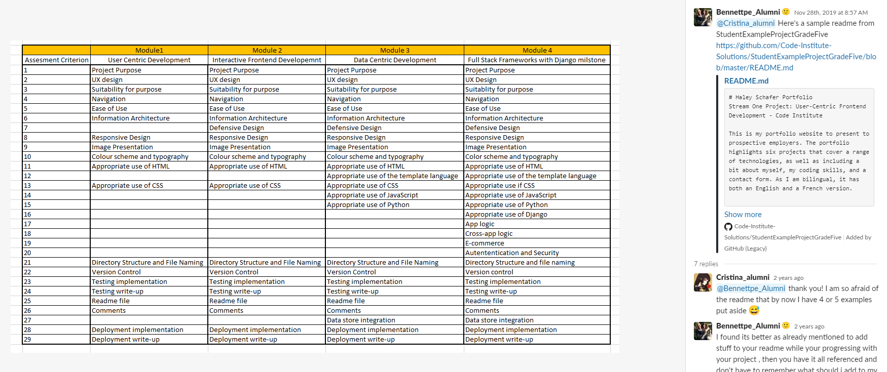

# Testing Of Milestone Project 4

## Table of Contents.

1.  [CSS Validation](#css-validator)
2.  [HTML Validation](#html-validator)
3.  [JS Validation](#js-validator)
4.  [Wireframe Comparison](#wireframe)
5.  [Lighthouse](#lighthouse)
6.  [Mobile](#mobile-testing)
7.  [Project Testing](#deployed-testing)
    - [Links](#links)
    - [Overlay](#overlay)
    - [Modal](#modal)
    - [Sign-up Form](#form)
8.  [User Stories](#user-stories)
    - [User Story 1](#user-story-1)
    - [User Story 2](#user-story-2)
    - [User Story 3](#user-story-3)
    - [User Story 4](#user-story-4)
9.  [Debugging](#debugging)

[Back to README.md](README.md)

## An excel spreadsheet of userstories for testing

## CSS Validator

Tested on W3C CSS Validator
[CSS Validation for https://family-favs-project.herokuapp.com/](https://jigsaw.w3.org/css-validator/validator)

    

## HTML Validator

Pass code through HTML Validator
[CSS Validation for https://family-favs-project.herokuapp.com/]

[http://family-favs-project.herokuapp.com/get_recipes](https://validator.w3.org/nu/?doc=http%3A%2F%2Ffamily-favs-project.herokuapp.com%2Fget_recipes)
[https://family-favs-project.herokuapp.com/register](https://validator.w3.org/nu/?doc=http%3A%2F%2Ffamily-favs-project.herokuapp.com%2Fregister)
[https://family-favs-project.herokuapp.com/login](https://validator.w3.org/nu/?doc=http%3A%2F%2Ffamily-favs-project.herokuapp.com%2Flogin)
[https://family-favs-project.herokuapp.com/create_recipe](https://validator.w3.org/nu/?doc=http%3A%2F%2Ffamily-favs-project.herokuapp.com%2Fcreate_recipe)
[http://family-favs-project.herokuapp.com/get_categories](https://validator.w3.org/nu/?doc=http%3A%2F%2Ffamily-favs-project.herokuapp.com%2Fget_categories)

## JS Validator

Tested the site with jshint.com validator.

## Wireframe Comparison

Comparing the deployed version against the development version(wireframes)

## Lighthouse

Tested the site using Lighthouse 

## Mobile

Tested the site for mobile-friendly usage

[https://search.google.com/test/mobile-friendly](https://search.google.com/test/mobile-friendly?id=10B7YLqttRT7af4Ml0gyCA)

## Project Testing

### Links

I have tested all links on all pages. All links work as intended. This allows the user to move from one page to another with ease.

## Debugging

## Favicon issue

## Media files not loading

## Add Review Error

## 500 Error

## Contact page error

## Nutrition Icon missing

## End of Testing Section

## No Image not loading

## Line length too long

Correct all issues with line length.  Run python3 -m flake8 and improve code formatting.

## Syntax Error in Basket

When I tried to open the app.  I got and Error 500
I then reset my config vars to DEVELOPMENT = True so I could see where the error was coming from.

The error pointed to a syntax error in my basket app.

!(SyntaxError)[media/testingimages/syntax_error_basket.png]

Fixed error by finding missing { and inserting it where necessary

Removed DEVELOPMENT = True from Config Vars

[Return to Table of Contents](#table-of-contents)
