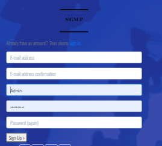

# Testing Of Milestone Project 4

## Table of Contents.

1.  [CSS Validation](#css-validator)
2.  [HTML Validation](#html-validator)
3.  [JS Validation](#js-validator)
4.  [Wireframe Comparison](#wireframe)
5.  [Lighthouse](#lighthouse)
6.  [Mobile](#mobile-testing)
7.  [Project Testing](#deployed-testing)
    - [Links](#links)
    - [Overlay](#overlay)
    - [Sign-up Form](#form)
8.  [User Stories](#user-stories)
    - [User Story 1](#user-story-1)
    - [User Story 2](#user-story-2)
    - [User Story 3](#user-story-3)
    - [User Story 4](#user-story-4)
9.  [Debugging](#debugging)

[Back to README.md](README.md)

## An excel spreadsheet of userstories for testing


## CSS Validator

Tested on W3C CSS Validator
[CSS Validation for https://fit-time-ms4.herokuapp.com/](https://jigsaw.w3.org/css-validator/validator)

<p>
    <a href="http://jigsaw.w3.org/css-validator/check/referer">
        
    </a>
</p

## HTML Validator

Pass code through HTML Validator
[CSS Validation for https://fit-time-ms4.herokuapp.com/]

[http://fit-time-ms4.herokuapp.com/](https://validator.w3.org/nu/?doc=https%3A%2F%2Ffit-time-ms4.herokuapp.com%2F)
[https://fit-time-ms4.herokuapp.com/products](https://validator.w3.org/nu/?doc=https%3A%2F%2Ffit-time-ms4.herokuapp.com%2Fproducts%2F)
[https://fit-time-ms4.herokuapp.com/reviews](https://validator.w3.org/nu/?doc=http%3A%2F%2Ffamily-favs-project.herokuapp.com%2Flogin)
[https://fit-time-ms4.herokuapp.com/contact](https://validator.w3.org/nu/?doc=http%3A%2F%2Ffamily-favs-project.herokuapp.com%2Fcreate_recipe)
[http://fit-time-ms4.herokuapp.com/](https://validator.w3.org/nu/?doc=http%3A%2F%2Ffamily-favs-project.herokuapp.com%2Fget_categories)

## JS Validator

Tested the site with jshint.com validator.

## Wireframe Comparison

Comparing the deployed version against the development version(wireframes)

For the home page on mobile/small screens - I added a home icon button, as the logo icon would not be displaying.
I added this to the icons at the top right hand corner of the page.


Changed the Join now button to a shop now button to bring you straight to the products page.


Added a footer to the site. To allow users to access our social links.  
Also added a link to the contact page here.


On the Product Item page, I added a section for reviews.
This would allow users to add a review for the product they are viewing.


The rest of the site followed the wireframes with no major changes.


## Lighthouse

Tested the site using Lighthouse 


## Mobile

Tested the site for mobile-friendly usage

[https://search.google.com/test/mobile-friendly](https://search.google.com/test/mobile-friendly/result?id=T_OzLyWJs5QK3IbkIhl4gA)


## Project Testing

### Links

I have tested all links on all pages. All links work as intended. This allows the user to move from one page to another with ease.


## Debugging

Shopping basket not opening

Missing endfor tag in template
This was an indentation error.
Went back through all the code and corrected indentation for endfor tag.
Also corrected spelling error for basket.


## Favicon issue

Favicon not displaying.
Since my last project, adding the favicon required a few different steps.
Solved this error by going through the steps with 
favicon generator.

And including the following tags

```
<!-- Favicon -->
            <link rel="apple-touch-icon" sizes="180x180" href="">
            <link rel="icon" type="image/png" sizes="32x32" href="">
            <link rel="icon" type="image/png" sizes="16x16" href="">
            <link rel="manifest" href="">
```


## Add Review Error

## 500 Error
## No Image not loading
Had a lot of trouble with Internal Server issues


I was getting an issue telling me that my products didn't exist.


I thought this was an error due to my database, but with help from tutor support, 
I realised I had renamed the images and they no longer matched the database.


I fixed this error and made sure the image names match with my Amazon S3 media file so that they could be called correctly.


I updated the media folders through Admin


Once they were the same, the images could now display correctly


Product Images displaying correctly


## Contact page error

## Nutrition Icon missing


## No Image not loading


## Line length too long

Correct all issues with line length.  Run python3 -m flake8 and improve code formatting.

## Syntax Error in Basket

When I tried to open the app.  I got and Error 500
I then reset my config vars to DEVELOPMENT = True so I could see where the error was coming from.

The error pointed to a syntax error in my basket app.

!(SyntaxError)[media/testingimages/syntax_error_basket.png]

Fixed error by finding missing { and inserting it where necessary

Removed DEVELOPMENT = True from Config Vars


## Scrolling error with Footer

Text was scrolling behind footer.  This meant the user couldn't see the buttons for checking
out or submitting.

Removed the fixed bottom option from the header and this resolved the issue.

"""
Error: Element li not allowed as child of element nav in this context. (Suppressing further errors from this subtree.)

From line 115, column 1; to line 115, column 29

eens -->↩↩<li class="list-inline-item">↩ 
"""
- Added <ul> to child element <li>


"""
Error: No space between attributes.

At line 180, column 78

="all-products"type="button"

"""

- add a space to correct this error.


"""
Warning: The type attribute is unnecessary for JavaScript resources.

From line 322, column 13; to line 322, column 43

          <script type="text/javascript">↩    
"""

- Removed the type="text/javascript" as no longer necessary.


## User Story Testing


## User Story 1

  
### What do I expect to find on a sports app?

1. I expect to be able to navigate around the app with ease.


Tested that all buttons were working and brought the user to the relevent pages.


2. I expect to be able to search for items to buy.

Created a search bar option.
This is set at the top of the site.


Allowing users to search for items on the site.

3. I would expect the app to be visually appealing.

I used mainly a blue theme, with some black and white throughout the site.

5. I would like to be able to edit my shopping basket.

Users will have the option to edit or remove items from their shopping basket
before they checkout.


6. I would like the site to be informative.

There is a description for the products to tell the customer about them.


## User Story 2

  As a website user, I want the app to be easy to use.  I would expect to be able to register and for my details to be secure and safe.

  Users can register with the site, by filling out their information on the sign up form.

  


### What do I expect to find on a web application?

  

1. Can I view my shopping basket?

Users can view their shopping bag, by clicking on the shopping basket icon at the top of the site.

2. Can I edit my shopping basket?

Users can edit their shopping basket, when the choose the check out option.

3. Can I delete items from my shopping basket?

Users can delete items from their basket before they checkout.

  

## User Story 3

### Would this app be suitable for younger family members?

  

1. Is the website suitable for all family members?

This website is aimed at anyone interested in taking time for themselves, to purchase sports related items.

2. Is it easy to navigate?

This site is easy to navigate with a range of buttons and links.

3. What age is the app intended?

This app is aimed at adults.

  

As a user, I would like to be able to edit my shopping bag.
  
## User Story 4

### Would this app have a good range of items?

  
1. Is the app easy to navigate?

This app is easy to navigate through links and buttons.

2. Are there educational advantages to this app?

This site is aimed mostly at fitness, it could be educational by adding some tips and
nutritional information on the nutrition section.

As a user, I would like to share my experiences and opinions of items bought.

Users can leave reviews on items they have purchased.

As a first time user, I would expect

•   A registration option.

Users can register on first time access to this site.

•   A login option.

If users are registered, there will be a login option.

•   Good Graphics

This site is kept simple in terms of graphics, so as not to have the 
site busy, for a calm straighforward shopping experience.

•   A good variety of items to buy.

This site would like to add a variety of products, classes and nutritional information.

•   A search option
  
There is a search option at the top of the site for users to look up items they would 
like to purchase.

As a returning user, I would expect 


•   A login option to create a user profile. 

Users can save their information and previous purchase can be viewed on a profile page.

•   My profile page is to be private for my use.

You will have to log in to view your profile page, as it will be personal to each user.

•   Updated content.

Content will be updated regularly, as the products for sale will change with styles and seasons.
  

As a designer, I would expect

  

•   All buttons to be working

All buttons are working as intended.

•   All links to be active

All links are working as intended.

•   To be able to navigate through the site with ease

The site is easy to navigate with a range of buttons and links.


•   To have a 404 page to return users to the home page.

Users can return to the home page if they get an error page.


•   Striking colours to engage the user

Colours are mainly blue, black and white. This is to keep the site from looking too busy, 
and to have a clean style to it.

•   To be able to add or delete categories.

Only site owners will have the option to add and delete categories through the admin.

*   To be able to add or delete products.

Only site owners will have the option to add and delete categories through the admin.

Products can be added by site owner.

Products can only be added by the site owner, in the management only log in.


## End of Testing Section
  
[Return to Table of Contents](#table-of-contents)
